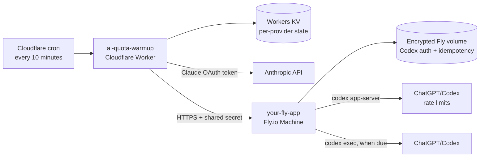

# 🔥 AI-Quota-Warmup 🚀

> Open Claude Code and ChatGPT/Codex quota windows before your work session.

[](https://coveralls.io/github/fungw/AI-Quota-Warmup?branch=main)

AI providers start rolling usage windows when the first request is made. If
that request happens late, the rest of the day's reset boundaries move with it.
AI-Quota-Warmup checks every 10 minutes and sends a tiny request near configured
target times, but only when the provider's previous window has closed.

## Architecture

Claude and OpenAI use different subscription-authentication paths, so the
deployment is intentionally split:



### Why OpenAI runs on Fly.io

The OpenAI branch is designed to use the ChatGPT-managed Codex allowance, not
OpenAI Platform API billing. A Cloudflare Worker can make HTTP requests, but it
cannot run the Codex CLI or persist its renewable ChatGPT login. The Fly Machine
provides that trusted Linux runtime and an encrypted persistent volume.

The runner uses the official Codex CLI in two ways:

- `codex app-server` with `account/rateLimits/read` reads the real ChatGPT/Codex
  primary-window reset. See the official [Codex App Server documentation](https://learn.chatgpt.com/docs/app-server).
- `codex exec` sends the small non-interactive warm-up request after the old
  window expires. See the official [non-interactive mode documentation](https://learn.chatgpt.com/docs/non-interactive-mode).

This is an advanced ChatGPT-managed authentication setup. Treat Codex's
`auth.json` as a password: it is created on the Fly volume during device login,
is never copied into the image, and must never be committed to this public
repository. The runner does not mount or execute repository code, and Codex
runs with a read-only sandbox.

## Request flow

For every cron tick, the Worker finds the most recent configured target in the
catch-up horizon and evaluates Claude and OpenAI independently:

1. If there is no eligible target, it skips both providers.
2. If a provider already served that target, it skips that provider.
3. If Workers KV says the provider's current window is still open, it skips the
   network request and checks again on the next tick.
4. Claude is called directly. Its response header supplies the next five-hour
   reset, which the Worker stores in KV.
5. OpenAI is called through the bearer-protected Fly endpoint. Fly reads the
   live Codex limit first:
   - If the window is open, Fly returns the authoritative reset without making
     a model request.
   - If the window has closed, Fly runs `codex exec`, reads the new reset, and
     returns it to the Worker.
6. The Worker stores each provider's result and reset separately. One provider
   failing does not prevent the other from running.

The Fly runner also keeps a small idempotency ledger on its persistent volume.
If Cloudflare retries after a lost response, the same target slot cannot trigger
a duplicate Codex request.

> The cron *checks* every 10 minutes; it does not spend quota every 10 minutes.
> An active provider window cannot be reset early. The first eligible request
> after it expires opens the next window.

## Default schedule

The defaults open four windows per day:

```text
06:00 → 11:00 → 16:00 → 21:00
```

Because 24 hours is not divisible by five, the remaining gap is placed
overnight. `TARGETS_LOCAL` is interpreted in `TARGET_TIMEZONE`, and the Worker
uses the IANA timezone on each run so daylight-saving changes are automatic.
`CATCHUP_HORIZON_MINUTES` controls how long a delayed target remains eligible.

## Components

| Component | Responsibility | Persistent data |
|---|---|---|
| [`worker/`](worker/) | Ten-minute cron, schedule and reset gating, direct Anthropic call, protected Fly call, structured logs | Separate Claude and OpenAI reset state in Workers KV |
| [`openai-runner/`](openai-runner/) | Authenticated HTTP endpoint, live Codex limit query, `codex exec`, duplicate suppression | Codex `auth.json` and idempotency ledger on an encrypted Fly volume |

The deployed Cloudflare Worker is named `ai-quota-warmup`; replace `your-fly-app`
below with the name of your Fly app.

## Configuration

The Worker supports `claude`, `openai`, or both:

```toml
[triggers]
crons = ["*/10 * * * *"]

[vars]
WARMUP_PROVIDERS = "claude,openai"
GPT_WARMUP_URL = "https://your-fly-app.fly.dev/warmup"
TARGETS_LOCAL = "06:00,11:00,16:00,21:00"
TARGET_TIMEZONE = "Europe/Dublin"
CATCHUP_HORIZON_MINUTES = "240"
```

Secrets are stored only by their respective platforms:

| Platform | Secret | Purpose |
|---|---|---|
| Cloudflare | `CLAUDE_CODE_OAUTH_TOKEN` | Authenticate the direct Anthropic request |
| Cloudflare | `GPT_WARMUP_SECRET` | Authenticate Cloudflare to the Fly runner |
| Fly.io | `WARMUP_SHARED_SECRET` | Must equal Cloudflare's `GPT_WARMUP_SECRET` |
| Fly volume | Codex `auth.json` | ChatGPT-managed Codex login, created by device authentication |

No `OPENAI_API_KEY` is required for the OpenAI path.

## Deployment overview

1. Deploy the Fly runner, create its encrypted `codex_data` volume, set
   `WARMUP_SHARED_SECRET`, and complete `codex login --device-auth` inside the
   Machine. See [`openai-runner/README.md`](openai-runner/README.md).
2. Create the Workers KV namespace, configure `worker/wrangler.toml`, and put
   `CLAUDE_CODE_OAUTH_TOKEN` and/or `GPT_WARMUP_SECRET` with Wrangler.
3. Deploy the Cloudflare Worker. See [`worker/README.md`](worker/README.md) for
   complete setup, local tests, logging fields, and manual verification.

After deployment, verify Fly first:

```bash
curl https://your-fly-app.fly.dev/health
# {"ok":true,"authenticated":true}
```

Then follow scheduled executions with:

```bash
cd worker
pnpm run tail
```

Routine `no-target`, `already-served`, and `window-still-open` skips are
expected. Investigate `run.failure`, a Fly health response with
`authenticated:false`, or repeated requests without a new reset timestamp.
If the ChatGPT login is revoked, repeat the Fly device-login command; the new
credentials remain on the volume across Machine stops and deployments.

## Development

```bash
cd worker && pnpm install && pnpm test && pnpm run typecheck
cd ../openai-runner && npm test
```

Provider calls are mocked by the automated tests. See
[`worker/docs/TEST_PLAN.md`](worker/docs/TEST_PLAN.md) for the Worker test
matrix.

## License

[MIT](LICENSE)
